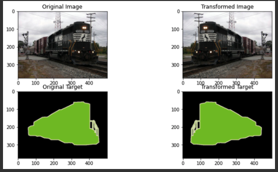
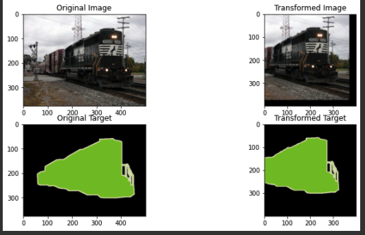
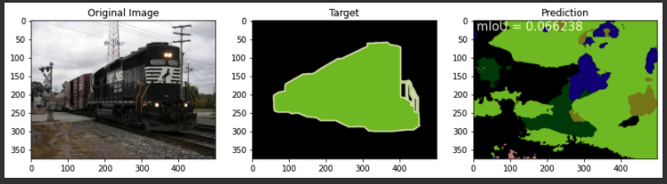
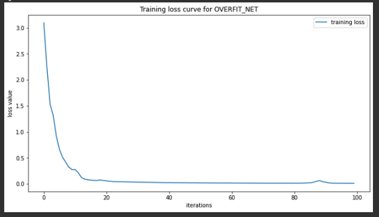
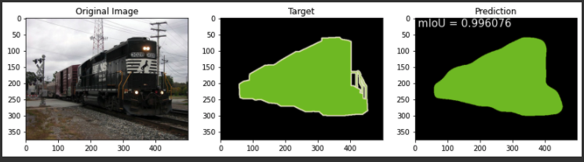
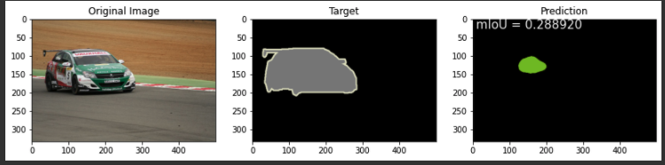
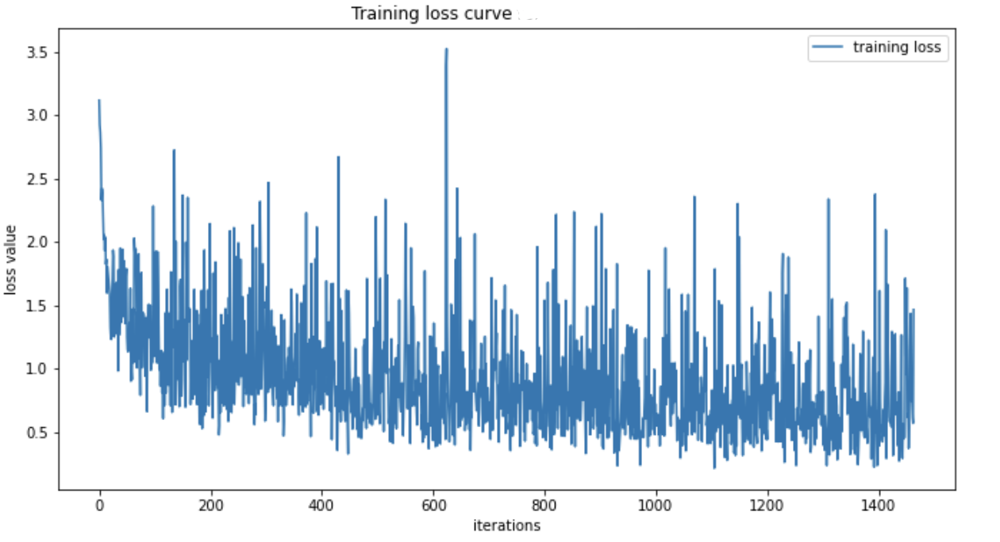
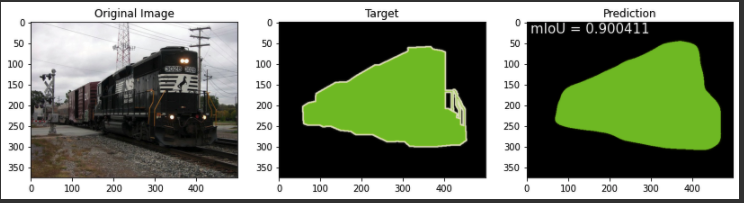
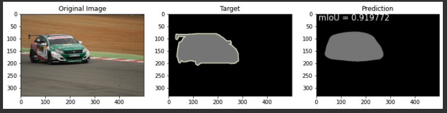

# Semantic Segmentation

Implemented Semantic Segmentation using ResNet18's structure and experimented with overfitted model's and regularly trained model's performance using miou as the evaluation metric.

The project uses Pascal dataset http://host.robots.ox.ac.uk/pascal/VOC/voc2012/index.html , which provides standardised image data sets for object class recognition with 21 classes (20 Classes + 1 "other"/"background"). In our case, we utilized ResNet18's first 5 layers' structure with skip connections added to perform visual object classification.

Each class is represented in pixels with different colors. Note that in our case, we are performing semantic segmentation. Instead of recognizing an object from an image, we want more. We want to predict which class does each pixel belong to as well. From the below, we can see that black pixels represent background. The 20 classes are: distribution among Person(person), Animal (bird, cat, cow, dog, horse, sheep), Vehicle (aeroplane, bicycle, boat, bus, car, motorbike, train) and Indoor (bottle, chair, dining table, potted plant, sofa, tv/monitor).

Below are some examples about the dataset we are using. 

The metric for model evaluation is mean Intersection over Union (mIoU), which focuses only on segment/classes, which is irrelevant to object sizes. mIoU is defined as below (screenshot from chainerCV documentation page:https://chainercv.readthedocs.io/en/stable/reference/evaluations.html#semantic-segmentation-iou ):

Nij in the below formula represents the number of pixels that are labeled as class i by the ground truth and class j by the prediction.

For each class, we calculate how similar is our prediction to the actual object pixelwise. More mathematically, we first calculate the intersection between our prediction and groud truth, and then we calculate the union of the prediction and ground truth. We then take the ratio of those two numbers. We have the ratio number for each class. Then, we average over all k classes, which is 21 in our case.

In our model, we used ResNet18's first 5 blocks as our feature encoder to extract the features and then we use added skip connection to concatenate the previous feature map (skipped feature map) and the current feature map (upsampled feature map) as our new feature map and then learn the corresponding decoder filter to interpolate the image to the original shape. The concatenated feature map's corresponding convolutional layer is quite symmetirc to how we extracted our features into deep feature maps, which will help the model learn how to combine individual features.

During the model fitting, we performed image segmentation with RandomResizedCrop and Random Horizontal Flip as demonstrated below:

  
  

After experimenting and augmenting the data and its transformations, we evaluate our untrained model immediately and see its performance. In our case, we only achieved 0.06 mIoU.

Then we tried to overfit the model on one single image for 100 epoch. The loss graph is presented below.

We can see that after 100 epoch, which is seriously overfitted, the loss is reduced / nearly converged. it reaches mIoU = accuracy on the trained image.

However, we can see that it performs poorly as expected on the new image. We can also see that our model simply tries to memorize the training image. When given a new image, it tries to classify based on the knowledge of memorizing one single image. We can see that the pixel class corresponding color is grey for the validation image and the pixel class corresponding color is gree for the training image. After overfitting, model tries to predict green color instead of grey.

Then, we started to train our model on the entire training set for 4 epochs with batch size = 4. The below is corresponding loss graph.

We also tried to validate our result. The accuracy is improved for test image and decreased a little bit for the training image, which is what we want to avoid overfitting.

